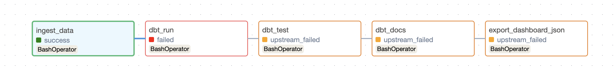
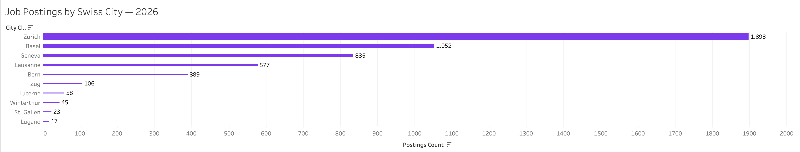
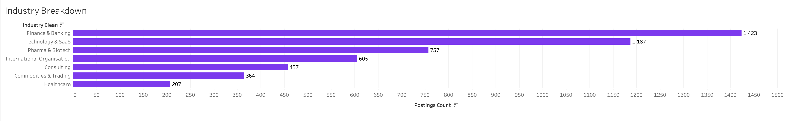
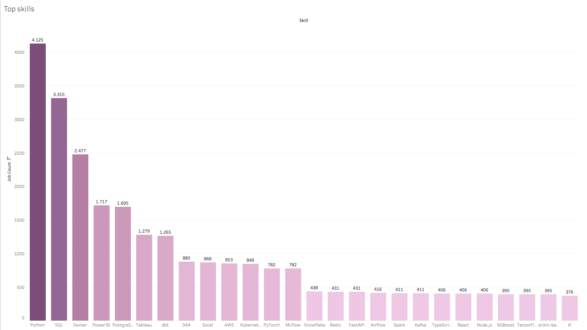
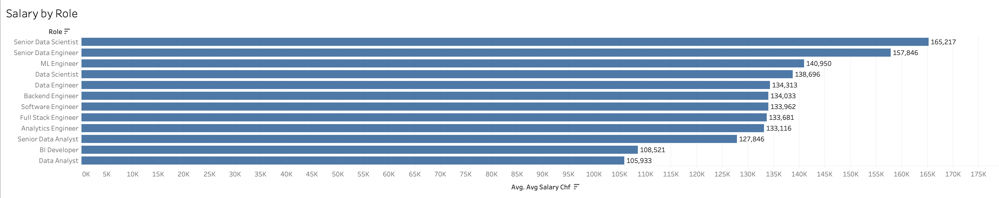
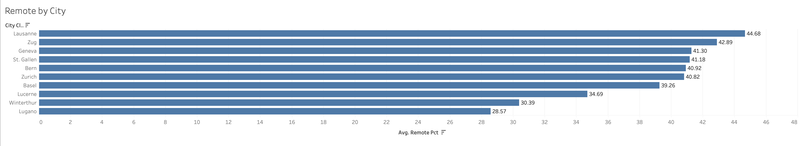
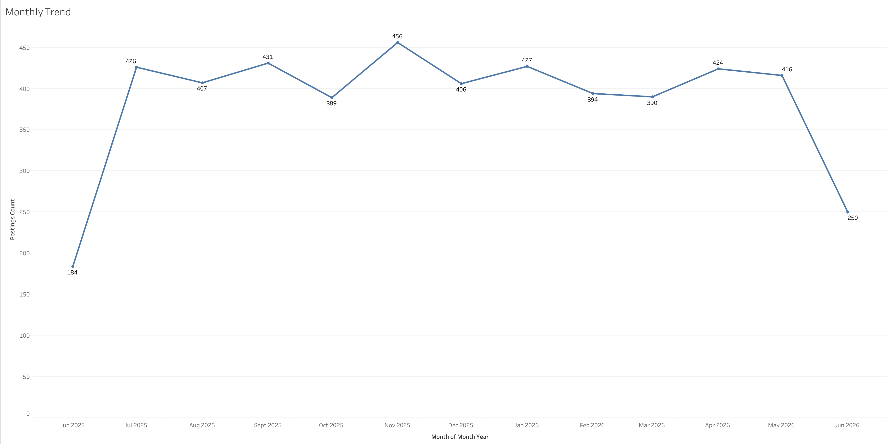

<div align="center">
  <h1>🇨🇭 Swiss Job Market Intelligence</h1>
  <p><strong>An end-to-end data engineering and analytics pipeline analyzing 5,000 Swiss tech job postings — from synthetic data generation and Airflow orchestration to interactive Tableau dashboards and a live web dashboard.</strong></p>
  <br/>
  
  
  
  
  
</div>

---

## Executive Summary

The Swiss tech job market is concentrated in Zurich, heavily skewed toward Finance & Banking, and clearly values Python, SQL, and Docker above all else. Senior data roles command salaries well above CHF 150K, while remote work is broadly accessible across all major cities — suggesting a mature, flexible market for tech talent.

This project builds a full data pipeline to explore those trends: synthetic job data is generated using realistic Swiss companies, ingested into PostgreSQL, transformed with dbt, orchestrated by Airflow, and surfaced through both a Tableau workbook and a browser-based dashboard.

<table align="center">
  <tr>
    <td align="center"><strong>Total Postings</strong></td>
    <td align="center"><strong>Avg. Salary</strong></td>
    <td align="center"><strong>Remote Rate</strong></td>
    <td align="center"><strong>Top City</strong></td>
    <td align="center"><strong>#1 Skill</strong></td>
  </tr>
  <tr>
    <td align="center">5,000</td>
    <td align="center">CHF 136,496</td>
    <td align="center">40.2%</td>
    <td align="center">Zurich (38%)</td>
    <td align="center">Python (4,125)</td>
  </tr>
</table>

---

## Pipeline Architecture

```
Python + Faker  ──▶  PostgreSQL  ──▶  Apache Airflow  ──▶  dbt  ──▶  Tableau / Web Dashboard
 (data gen)         (raw store)        (orchestration)   (transforms)   (analytics layer)
```

| Layer | Technology |
|---|---|
| Data generation | Python, Faker, NumPy, Pandas |
| Database | PostgreSQL |
| Orchestration | Apache Airflow |
| Transformation | dbt (staging → intermediate → marts) |
| BI / Visualization | Tableau Desktop |
| Web dashboard | HTML, CSS, JavaScript (Chart.js) |
| EDA | Jupyter Notebook |

<div align="center">
  
</div>

The Airflow DAG runs five tasks in sequence: raw data ingestion into PostgreSQL, dbt transformation, dbt tests, docs generation, and JSON export for the web dashboard.

---

## Key Insights

### Hiring by City — Zurich Dominates

<div align="center">
  
</div>

Zurich accounts for **1,898 postings (38%)** of all listings — nearly double Basel (1,052) and more than double Geneva (835). The concentration reflects Switzerland's financial and tech hub structure. Smaller cities like Zug and Lucerne show meaningful activity in their niches (finance and pharma respectively) but at much lower volumes.

---

### Industry Breakdown — Finance & Banking Leads

<div align="center">
  
</div>

Finance & Banking (1,423 postings) and Technology & SaaS (1,187) together account for over **52% of all listings**. Pharma & Biotech (757) rounds out the top 3, reflecting Switzerland's strengths in banking (Zurich, Zug) and life sciences (Basel, Geneva). Healthcare is underrepresented at just 207 postings — data roles in that sector are still emerging.

---

### Top Skills — Python Is Non-Negotiable

<div align="center">
  
</div>

Python (4,125) and SQL (3,315) appear in over **65% of all postings** — making them the non-negotiable baseline for any data or engineering role. Docker (2,477) ranks third, reflecting a containerization-first culture in Swiss tech teams. Power BI and PostgreSQL follow closely, while tools like dbt, Airflow, Kafka, and Spark signal strong demand for modern data stack skills in senior positions.

---

### Salary by Role — Seniority Pays

<div align="center">
  
</div>

Senior Data Scientists top the chart at **CHF 165,217**, followed by Senior Data Engineers (CHF 157,846) and ML Engineers (CHF 140,950). The jump between senior and non-senior roles is significant — Data Scientists earn CHF 138,696 vs CHF 165,217 for their senior counterparts, a **~20% premium for seniority**. BI Developers (CHF 108,521) and Data Analysts (CHF 105,933) sit at the lower end, reflecting the commoditization of reporting roles relative to engineering and ML.

---

### Remote Work by City — Geography Doesn't Limit Flexibility

<div align="center">
  
</div>

Remote flexibility is broadly distributed across all cities, ranging from **44.7% in Lausanne** to 28.6% in Lugano. Lausanne and Zug lead — likely tied to their international and financial company bases. Winterthur and Lugano trail, possibly due to more manufacturing and regional firm presence. Zurich (40.8%) is close to the national average despite being the largest market, suggesting strong hybrid norms rather than full office mandates.

---

### Monthly Hiring Trend — Stable with Seasonal Dips

<div align="center">
  
</div>

Hiring peaked in **November 2025 (456 postings)** and stayed broadly stable through mid-2026, between 390–430 postings per month. Two clear dips stand out: October 2025 (389) likely reflecting a post-summer slowdown, and June 2026 (250) showing the typical early-summer slowdown as companies freeze headcount ahead of holiday periods. The data suggests Swiss tech hiring is relatively consistent year-round with moderate seasonal variation.

---

## Recommendations

<table>
  <tr>
    <td valign="top" width="50%">
      <h3>For Job Seekers Targeting Switzerland</h3>
      <ul>
        <li><strong>Python + SQL + Docker is the minimum viable stack.</strong> These three skills appear in over 65% of postings — without them, you're filtered out before the interview.</li>
        <li><strong>Target Zurich first.</strong> 38% of all postings are there, and Finance & Banking firms offer the highest volume of data roles. Geneva and Basel are strong alternatives with more pharma/biotech exposure.</li>
        <li><strong>Seniority is worth pursuing aggressively.</strong> The jump from Data Scientist to Senior Data Scientist is ~CHF 26,500/year (+20%). Specializing early pays off significantly in this market.</li>
        <li><strong>Remote flexibility is table stakes.</strong> With 40%+ remote rates across all major cities, you have strong negotiating ground for hybrid arrangements — especially in Lausanne and Zug.</li>
        <li><strong>Add dbt and Airflow to your resume.</strong> They appear consistently in mid-to-senior postings and signal modern data stack fluency that most analysts don't yet have.</li>
      </ul>
    </td>
    <td valign="top" width="50%">
      <h3>For This Project</h3>
      <ul>
        <li><strong>Connect to a live job board API.</strong> The current data is synthetic — plugging into a real source (LinkedIn, JobUp.ch, jobs.ch) would make this production-grade and the insights actionable.</li>
        <li><strong>Add a skills co-occurrence analysis.</strong> Knowing that Python and dbt appear together in 80% of Data Engineer postings is more useful than standalone counts.</li>
        <li><strong>Build a salary prediction model.</strong> With role, city, seniority, and skill set as features, a regression model could predict expected compensation — a natural next step for the ML layer.</li>
        <li><strong>Track trends over time.</strong> Extending the Airflow DAG to run weekly and append to the database would enable real trend detection — which skills are rising, which cities are cooling.</li>
        <li><strong>Publish to Tableau Public.</strong> Making the workbook publicly accessible would allow the dashboards to be embedded directly in a portfolio site.</li>
      </ul>
    </td>
  </tr>
</table>

---

## Dashboards

### Tableau Workbook (`swissjobs.twbx`)

Five navigable dashboards with KPI cards on every view and consistent purple design:

| Dashboard | What it shows |
|---|---|
| **Overview** | Total postings, avg salary, remote %, monthly trend, industry breakdown |
| **Skill Demand** | Top skills ranked by job count |
| **Salary Intelligence** | Average salary by role |
| **City Intelligence** | Postings by city + remote rate per city |
| **Market Trends** | Month-over-month hiring trend |

Open `swissjobs.twbx` in Tableau Desktop and use the purple nav buttons to switch between dashboards.

### Web Dashboard

🌐 **[Live Dashboard → victoriaest1.github.io/swiss-job-intelligence](https://victoriaest1.github.io/swiss-job-intelligence/)**

No installation needed — opens directly in the browser. Built with HTML, CSS, and Chart.js, it mirrors all five Tableau views with interactive charts, KPI cards, and a responsive layout that works on desktop and mobile. Data is pre-exported from the dbt marts layer into a single JSON file, keeping the dashboard fully self-contained with no backend required.

---

## Project Structure

```
swiss-job-intelligence/
├── ingestion/
│   └── data_generator.py          # Synthetic job posting generator (Faker + psycopg2)
├── airflow/
│   └── dags/
│       └── swiss_jobs_pipeline.py # Airflow DAG: ingest → transform → export
├── dbt_project/
│   └── swiss_jobs_dbt/
│       └── models/
│           ├── staging/            # Raw source cleaning
│           ├── intermediate/       # Business logic
│           └── marts/              # Final analytics tables
├── notebooks/
│   └── swiss_job_market_eda.ipynb  # Exploratory data analysis
├── dashboard/
│   ├── index.html                  # Web dashboard
│   └── dashboard_data.json         # Pre-exported JSON for web view
├── docs/
│   ├── swiss_eda.html              # Exported EDA notebook
│   └── images/                     # Dashboard screenshots
├── scripts/
│   └── generate_dashboard_data.py
├── swissjobs.twbx                  # Tableau workbook
└── run_update.command              # One-click pipeline refresh
```

---


## About the Data

Synthetically generated using Python's Faker library with Swiss-specific context:

- **80+ real Swiss companies** across finance (UBS, Julius Bär, Swiss Re), pharma (Roche, Novartis, Lonza), and tech (Google Zurich, Swisscom, Avaloq)
- **10 Swiss cities** with realistic posting volume distributions
- **30+ tech skills** weighted by actual market demand
- **Role-adjusted CHF salaries** reflecting Swiss market rates
- **12 months** of posting data (Jun 2025 – Jun 2026)

> This is a portfolio project. All data is synthetic and generated for demonstration purposes only.


